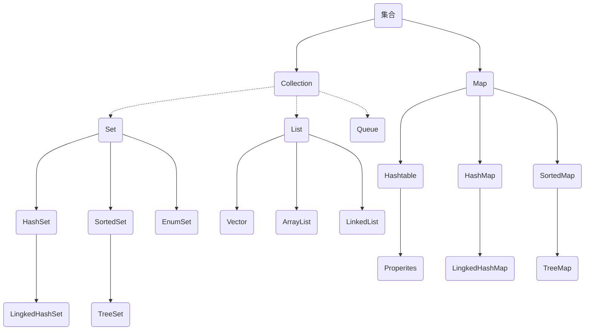
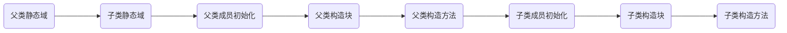

# Java基础知识

## 面向对象的基本原则

单一职责原则（**SRP**）

开放封闭原则（**OCP**） 

里氏替换原则（**LSP**） 

依赖倒置原则（**DIP**） 

接口隔离原则（**ISP**）

面向对象的最重要的特性是支持继承、封装和多态

系统设计应该遵循开闭原则，系统应该稳定不不可修改，但应支持通过继承、组合等方式进行扩展

面向对象设计时，每个类的职责应该单一，不要再一个类中引入过多的接口

过程式语言和面向对象的语言各有其优势，过程式语言更加灵活，面向对象语言更加强调抽象和封装

Java和C++都是静态类型的面向对象编程语言

## 算法

算法包括0个或多个**输入**，1个或多个**输出**，中间有穷个**处理**过程。
存储结构不属于算法结构

## 编译与运行

java编译成的是class字节码文件，与系统无关。再被各系统的jvm翻译成系统可以识别的机器码，这就是java一次编程多平台应用的跨平台性。

字节码和机器码不是一回事，java程序在运行时字节码才会被jvm翻译成机器码，所以说java是解释性语言。

**native关键字**表名修饰的方法是由其它非Java语言编写的

能够出现在import语句前的有**注释语句**、用来声明包的**package语句**

## 标识符命名规则

由26个英文字母大小写，数字：0-9 符号：_ $ 组成

标识符应以字母、_ 、$开头

标识符不能是关键字

严格区分大小写

## Java关键字

Java中的关键字都是小写，null、false、true是常量，不是关键字。

| 访问控制         | private  | protected  | public   |           |              |           |        |
| ---------------- | -------- | ---------- | -------- | --------- | ------------ | --------- | ------ |
| 类方法变量修饰符 | abstract | class      | extends  | final     | implements   | interface | native |
|                  | new      | static     | strictfp | transient | synchronized | volatile  |        |
| 程序控制         | break    | continue   | return   | do        | while        | if        | else   |
|                  | for      | instanceof | switch   | case      | default      |           |        |
| 错误处理         | try      | catch      | throw    | throws    |              |           |        |
| 包相关           | import   | package    |          |           |              |           |        |
| 基本类型         | boolean  | byte       | char     | double    | float        | int       | long   |
|                  | short    |            |          |           |              |           |        |
| 变量引用         | super    | this       | void     |           |              |           |        |
| 保留字           | goto     | const      |          |           |              |           |        |
|                  | enum     | assert     |          |           |              |           |        |

## AOP 和 OOP的区别：

1. 面向方面编程 **AOP** 偏重业务处理过程的某个步骤或阶段，强调降低模块之间的耦合度，使代码拥有更好的移植性。
2. 面向对象编程 **OOP** 则是对业务分析中抽取的实体进行方法和属性的封装。
也可以说 AOP 是面向业务中的动词领域， OOP 面向名词领域。

# 基本语法

## 与或非

```java
b = i < 10 |  methodB(4); //中间为与计算符，两边都执行，执行完methodB(4)后，j = 4
b = i < 10 || methodB(8); //中间为或计算符，因为i < 10 已成立，不需要后续计算
```

## try/catch/finally

在try语句块或catch语句块中执行到System.exit(0)直接退出程序

不管catch是否捕获异常，finally语句块都是要被执行的

finally块中的return语句会覆盖try块中的return返回

finally 语句块在 catch语句块中的return语句执行完成之前，return表达式的结果会暂时保存起来

```java
int i = 0;
try {
    System.out.println("try" + i);
    throw new Exception("123");
} catch (Exception e) {
    return i++;
} finally {
    System.out.println("finally" + i);
}

//结果：
//try0
//finally1
```

## i=i++

Java使用了中间缓存变量机制：

i=i++;等同于：
temp=i； (等号右边的i)
i=i+1;      (等号右边的i)
i=temp;   (等号左边的i)

而i=++i;则等同于：
i=i+1;
temp=i;
i=temp;

# 数据类型

## 不同基本数值类型的自动转换

Java计算表达式转型规则由低到高转换：（待看视频）

1、所有的byte,short,char型的值将被提升为int型；

2、如果有一个操作数是long型，计算结果是long型；

3、如果有一个操作数是float型，计算结果是float型；

4、如果有一个操作数是double型，计算结果是double型；

5、被fianl修饰的变量不会自动改变类型，当2个final修饰相操作时，结果会根据左边变量的类型而转化。


两个数值进行二元操作时，会有如下的转换操作：

如果两个操作数其中有一个是double类型，另一个操作就会转换为double类型。

否则，如果其中一个操作数是float类型，另一个将会转换为float类型。

否则，如果其中一个操作数是long类型，另一个会转换为long类型。

否则，两个操作数都转换为int类型。

double>float>long>int

## 基本数据类型包装类型

Byte是byte的包装类型，初始化为null而不是0

## 值范围

Byte类型值大小为-128~127之间，a=127,++a会越界，a的值变为-128;

## 自动装包/自动拆包

```java
public void add(Byte b){ 
    b=b++; 
} 
```

这里涉及java的自动装包/自动拆包(AutoBoxing/UnBoxing) Byte的首字母为大写，是类，看似是引用传递，但是在add函数内实现++操作，会自动拆包成byte值传递类型，方法调用处传入变量的值不会改变。

## String

java中将ISO8859-1字符串转成GB2312编码：

```java
new String("这是要转换的字符串".getBytes("ISO8859-1"),"GB2312")
    //1
    String.getBytes(String charsetName);//得到的是以charsetName编码得到的byte数组 byte[]  
	"这是要转换的字符串".getBytes("ISO8859-1");
	//2 String的构造函数 
    String (byte[] bytes,String charsetName);//符数组按照GB2312编码成新的字符串

dst=new String(src，"GBK").getBytes("UTF-8");
```

string和char数组都是引用类型，引用类型是传地址的，会影响原变量的值，但是string是特殊引用类型，作为参数传入后，方法只改变形参，原变量不变，类似基本数据类型

String是不可修改的，且java运行环境中对string对象有一个对象池保存

### replaceAll方法

**"com.jd.". replaceAll(".", "/")，**replaceAll方法的第一个参数是一个正则表达式

**"."**在正则表达式中表示任何字符，把前面字符串的所有字符都替换成"/"

如果想替换的只是**"."**，那么久要写成**\ \ .**

## 数组

在java 中，声明一个数组时，不能直接限定数组长度，只有在创建实例化对象时，才能对给定数组长度。

String a[]=new String[50];

String b[];

char c[];

## 字符、字节

java采用的uincode编码，两个字节表示一个字符，因此 char型在java中占2个字节，而int型占4个字节

Java采用unicode来表示字符，java中的一个char是2个字节（byte)，一个中文或英文字符的unicode编码都占2个字节。

在 GB 2312 编码或 GBK 编码中，一个英文字母字符存储需要1个字节，一个汉子字符存储需要2个字节。

在UTF-8编码中，一个英文字母字符存储需要1个字节，一个汉字字符储存需要3到4个字节。

在UTF-16编码中，一个英文字母字符存储需要2个字节，一个汉字字符储存需要3到4个字节（Unicode扩展区的一些汉字存储需要4个字节）。

在UTF-32编码中，世界上任何字符的存储都需要4个字节。


# 集合

**Collection**接口：单列数据，定义了存取一组对象的方法的集合

​	**List**：元素有序、可重复的集合

​			Vetor:

​			ArrayList:

​			LinkedList:

​	**Set**：元素无序、不可重复的集合

​			HashSet:

​				LingkedHashSet:

​			SortedSet:

​				TreeSet:

​	**Queue**:

**Map**接口：双列数据，保存具有映射关系“key-value对”的集合

​		Hashtable:

​			Properties:

​		HashMap:

​			LinkedHashMap:

​		SortedMap:

​			TreeMap:

## Hash冲突

**threadlocalmap**使用开放定址法解决hash冲突

**hashmap**使用链地址法解决hash冲突

## 线程安全

简单记忆线程安全的集合类： 

喂！SHE！  

喂 **vector**

S **stack** 

H **hashtable**，不能存储 null 值（hashmap可以）

E **Eenumeration**




# IO流

可以理解为字符流=字节流+编码集

字符流和字节流每次读入的字节数是**不确定**的，可能相同也可能不相同；字符流和字节流都有缓冲流

| (抽象基类) | 字节流       | 字符流 |
| ---------- | ------------ | ------ |
| **输入流** | InputStream  | Reader |
| **输出流** | OutputStream | Writer |

| 分类           | 字节输入流              | 字节输出流               | 字符输入流            | 字符输出流             |
| -------------- | ----------------------- | ------------------------ | --------------------- | ---------------------- |
| **抽象基类**   | **InputStream**         | **OutputStream**         | **Reader**            | **Writer**             |
| **访问文件**   | **FileInputStream**     | **FileOutputStream**     | **FileReader**        | **FileWriter**         |
| **访问数组**   | ByteArrayInputStream    | ByteArrayOutputStream    | CharArrayReader       | CharArrayWriter        |
| **访问管道**   | PipedInputStream        | PipedOutputStream        | PipedReader           | PipedWriter            |
| **访问字符串** |                         |                          | StringReader          | StringReader           |
| **缓冲流**     | **BufferedInputStream** | **BufferedOutputStream** | **BufferedReader**    | **BufferedWriter**     |
| **转换流**     |                         |                          | **InputStreamReader** | **OutputStreamWriter** |
| **对象流**     | **ObjectInputStream**   | **ObjectOutputStream**   |                       |                        |
|                | FilterInputStream       | FilterOutputStream       | FilterReader          | FilterWriter           |
| **打印流**     |                         | PrintOutputStream        |                       | PrintWriter            |
| **推回输入流** | PushbackInputStream     |                          | PushbackReader        |                        |
| **特殊流**     | DataInputStream         | DataOutputStream         |                       |                        |

> 字符流
> Reader 
> |-- InputStreamReader (byte->char 桥梁） 
> |-- BufferedReader (常用） 
> Writer 
> |-- OutputStreamWriter (char->byte 桥梁） 
> |-- BufferedWriter 
> |-- PrintWriter （常用）

按流的角色的不同分为：

节点流：可以从或向一个特定的地方（节点）读写数据。如FileReader.

处理流：是对一个已存在的流的连接和封装，通过所封装的流的功能调用实现数据读写。如BufferedReader.处理流的构造方法总是要带一个其他的流对象做参数。一个流对象经过其他流的多次包装，称为流的链接。

链接：https://www.nowcoder.com/questionTerminal/89307747e8904102b26505712a5191d4
来源：牛客网

## JAVA常用的节点流

文 件 FileInputStream FileOutputStrean FileReader FileWriter 文件进行处理的节点流。
字符串 StringReader StringWriter 对字符串进行处理的节点流。
数 组 ByteArrayInputStream ByteArrayOutputStreamCharArrayReader CharArrayWriter 对数组进行处理的节点流（对应的不再是文件，而是内存中的一个数组）。
管 道 PipedInputStream PipedOutputStream PipedReaderPipedWriter对管道进行处理的节点流。

## 常用处理流

（关闭处理流使用关闭里面的节点流）

缓冲流：BufferedInputStrean BufferedOutputStream BufferedReader BufferedWriter  增加缓冲功能，避免频繁读写硬盘。
转换流：InputStreamReader OutputStreamReader 实现字节流和字符流之间的转换。
数据流 DataInputStream DataOutputStream  等-提供将基础数据类型写入到文件中，或者读取出来.

## 流的关闭顺序

一般情况下是：先打开的后关闭，后打开的先关闭
另一种情况：看依赖关系，如果流a依赖流b，应该先关闭流a，再关闭流b。例如，处理流a依赖节点流b，应该先关闭处理流a，再关闭节点流b
可以只关闭处理流，不用关闭节点流。处理流关闭的时候，会调用其处理的节点流的关闭方法。

## flush()

flush()函数强制将缓冲区中的字符流、字节流等输出，原因是如果输出流输出到缓冲区完成后，缓冲区并没有填满，那么缓冲区将会一直等待被填满。所以在关闭输出流之前要调用flush()。

# 多线程

**CountDownLatch**：一个或者多个线程，等待其他多个线程完成某件事情之后才能执行； 

**CyclicBarrier**：多个线程互相等待，直到到达同一个同步点，再继续一起执行。

对于CountDownLatch来说，重点是“一个线程（多个线程）等待”，而其他的N个线程在完成“某件事情”之后，可以终止，也可以等待。 

而对于CyclicBarrier，重点是多个线程，在任意一个线程没有完成，所有的线程都必须互相等待，然后继续一起执行。 CountDownLatch是计数器，线程完成一个记录一个，只不过计数不是递增而是递减，而CyclicBarrier更像是一个阀门，需要所有线程都到达，阀门才能打开，然后继续执行。 按照这个题目的描述等所有线程都到达了这一个阀门处，再一起执行

## 线程安全

**synchrozied**关键字称作同步，主要用来给方法、代码块加锁，被加锁的代码段，同一时间内多线程同时访问同一对象的加锁方法/代码块时，只能有一个线程执行能执行方法/代码块中的代码，其余线程必须等待当前线程执行完以后才执行该方法/代码块。
**volatile**关键字1.保证了不同线程对该变量操作的内存可见性.(当一个线程修改了变量,其他使用次变量的线程可以立即知道这一修改)。2.禁止了指令重排序.volatile关键字是一种轻量级的同步机制，只保证数据的可见性，而不保证数据的原子性

**volatile**关键字有两个作用：
1.并发环境可见性：volatile修饰后的变量能够保证该变量在线程间的可见性，线程进行数据的读写操作时将绕开工作内存（CPU缓存）而直接跟主内存进行数据交互，即线程进行读操作时直接从主内存中读取，写操作时直接将修改后端变量刷新到主内存中，这样就能保证其他线程访问到的数据是最新数据
2.并发环境有序性：通过对volatile变量采取内存屏障（Memory barrier）的方式来防止编译重排序和CPU指令重排序，具体方式是通过在操作volatile变量的指令前后加入内存屏障，来实现happens-before关系，保证在多线程环境下的数据交互不会出现紊乱。

**Lock**接口提供了与synchronized关键字类似的同步功能，但需要在使用时手动获取锁和释放锁。
**transient**关键字  简单地说，就是让某些被修饰的成员属性变量不被序列化。

## 单例线程安全

枚举
静态内部类
双检锁模式
饿汉式

```java
//第一种：饿汉模式（线程安全）
public class Single2 {
    private static Single2 instance = new Single2();
    private Single2(){
        System.out.println("Single2: " + System.nanoTime());
    }
    public static Single2 getInstance(){
        return instance;
    }
}

//第二种：懒汉模式 （如果方法没有synchronized，则线程不安全）
public class Single3 {
    private static Single3 instance = null;
    private Single3(){
        System.out.println("Single3: " + System.nanoTime());
    }
    public static synchronized Single3 getInstance(){//无synchronized时多个线程可能同时进入
        if(instance == null){
            instance = new Single3();
        }
        return instance;
    }
}

//第三种：懒汉模式改良版（线程安全，使用了double-check，即check-加锁-check，目的是为了减少同步的开销）
public class Single4 {
    private volatile static Single4 instance = null;
    private Single4(){
        System.out.println("Single4: " + System.nanoTime());
    }
    public static Single4 getInstance(){
        if(instance == null){
            synchronized (Single4.class) {
                if(instance == null){
                    instance = new Single4();
                }
            }
        }
        return instance;
    }
}
//第四种：利用私有的内部工厂类（线程安全，内部类也可以换成内部接口，不过工厂类变量的作用于要改为public了。）
public class Singleton {
    private Singleton(){
        System.out.println("Singleton: " + System.nanoTime());
    }
    public static Singleton getInstance(){
        return SingletonFactory.singletonInstance;
    }
    private static class SingletonFactory{
        private static Singleton singletonInstance = new Singleton();
    }
}
```

## 同步

同步器是一些使线程能够等待另一个线程的对象，允许它们协调动作。最常用的同步器是CountDownLatch和Semaphore，不常用的是Barrier 和Exchanger

Java 并发库 的Semaphore 可以很轻松完成信号量控制，Semaphore可以控制某个资源可被同时访问的个数，通过 acquire() 获取一个许可，如果没有就等待，而 release() 释放一个许可。

CyclicBarrier 主要的方法就是一个：await()。await() 方法没被调用一次，计数便会减少1，并阻塞住当前线程。当计数减至0时，阻塞解除，所有在此 CyclicBarrier 上面阻塞的线程开始运行。

直译过来就是倒计数(CountDown)门闩(Latch)。倒计数不用说，门闩的意思顾名思义就是阻止前进。在这里就是指 CountDownLatch.await() 方法在倒计数为0之前会阻塞当前线程。

Counter不是并发编程的同步器

# 类相关

## 四种访问权限修饰符

**public > protected > (缺省)  > private**

|  修饰符   | 类内部 | 同一个包 | 不同包的子类 | 同一个工程 |
| :-------: | :----: | :------: | :----------: | :--------: |
|  private  |   √    |          |              |            |
| （缺省）  |   √    |    √     |              |            |
| protected |   √    |    √     |      √       |            |
|  public   |   √    |    √     |      √       |     √      |

对于class的权限修饰只可以用public和default(缺省)。
public类可以在任意地方被访问。
default类只可以被同一个包内部的类访问。

### 构造方法

构造方法可以用private，protected，default，private

在创建派生类对象，构造函数的执行顺序：

基类构造函数，派生类对象成员构造函数（成员构造函数是指，静态或非静态变量可能是其他类的实例，加载这个实例的时候就必须调用它自身的构造函数），派生类本身的构造函数



父类没有无参的构造函数时，子类需要在自己的构造函数中显式调用父类的其他构造函数

### 接口

接口方法的修饰符可以是：public，abstract，缺省，static（后两者需要有{}）

子类重写父类方法时，方法的访问权限不能小于原访问权限，在接口中，方法的默认权限就是public，所以子类重写后只能是public

接口中不存在变量，只有常量，默认为public static final，要么不写，要么只能出现这个修饰词中的一个或多个这个来修饰“变量”

## 内部类

内部类：

​	成员内部类：4种访问权限：private、protected、public以及默认的访问权限

​	局部内部类：方法中、代码块中。局部内部类和局部变量地位类似，不能使用public,protected,缺省,private；不能使用static修饰，因此也不能包含静态成员

```java
class 外部类{
    //方法
	Method(){
		class 局部内部类{
		}
	}
    //代码块
	{
		class 局部内部类{
		}
	}
}
```
## Object类

Java中所有的类都直接或间接继承自Object，无论是否明确的指明，无论其是否是抽象类。

接口没有继承Object类。（一旦继承，Object中可以有实例方法的）

Object的equals方法，只有一句话，

```java
return this==object
```

Object的方法：hashCode、equals、toString、clone、notify、notifyall、wait、finalize、getClass

## Import

```java
PrintWriter out = ``new` `PrintWriter
```

代码中使用了printWriter 类，所以要导入此类Import java.io.PrintWriter;

```java
new java.io.OutputStreamWriter(System.out), true);
```

在创建OutputStreamWriter的时候，使用的是类的全名称。所以不需要使用import

# 声明关键字的使用

## final类与abstract类

**final**:修饰的类为终态类，不能被继承

**abstract**:修饰的类为抽象类，必须被继承才有意义

**abstract**类定义中可以没有abstract方法

**final**是不能用来修饰abstract抽象类，矛盾。

**abstract**类只能用来派生子类，不能用来创建abstract类的对象。

**final**类不能用来派生子类，因为用final修饰的类不能被继承；

**final**修饰的方法为终态方法，不能被重写。

**abstract**抽象方法不允许有方法体，同时不能有大括号，应直接以分号结束。

final是不能用来修饰abstract抽象方法，矛盾。

```java
public abstract class Test {
	abstract void method();//抽象方法
}
```

# JDBC

**ResultSet**跟普通的数组不同，索引从1开始而不是从0开始


# JVM

## JVM内存五大区域


**jvm堆**分为：

​	**新生代**（一般是一个Eden区，两个Survivor区），

​	**老年代**（old区）。

常量池属于 PermGen（方法区）

## **jvm的垃圾回收方式**

新生代基本采用复制算法，老年代采用标记整理算法。cms采用标记清理。

垃圾回收在jvm中优先级相当相当低。

垃圾收集器（GC）程序开发者只能推荐JVM进行回收，但何时回收，回收哪些，程序员不能控制。

垃圾回收机制只是回收不再使用的JVM内存，如果程序有严重BUG，照样内存溢出。

进入DEAD的线程，它还可以恢复，GC不会回收

## Java内存区域介绍

A.**程序计数器**是一块较小的内存空间，它的作用可以看做是当前线程所执行的字节码的信号指示器（偏移地址），Java编译过程中产生的字节码有点类似编译原理的指令，程序计数器的内存空间存储的是当前执行的字节码的偏移地址，每一个线程都有一个独立的程序计数器（程序计数器的内存空间是线程私有的），因为当执行语句时，改变的是程序计数器的内存空间，因此它不会发生内存溢出 ，并且程序计数器是jvm虚拟机规范中唯一一个没有规定 OutOfMemoryError 异常 的区域；

B.**java虚拟机栈**：线程私有，生命周期和线程一致。描述的是 Java 方法执行的内存模型：每个方法在执行时都会床创建一个栈帧(Stack Frame)用于存储局部变量表、操作数栈、动态链接、方法出口等信息。每一个方法从调用直至执行结束，就对应着一个栈帧从虚拟机栈中入栈到出栈的过程。  没有类信息，类信息是在方法区中

C.**java堆**：对于绝大多数应用来说，这块区域是 JVM 所管理的内存中最大的一块。线程共享，主要是存放对象实例和数组

D.**方法区**：属于共享内存区域，存储已被虚拟机加载的类信息、常量、静态变量、即时编译器编译后的代码等数据。

## 异常

OutOfMemoryError

java.lang.OutOfMemoryError: PermGen space 增加-XX:MaxPermSize这个参数的值的话，这个问题通常会得到解决。属于运行时常量池导致的溢出

java.lang.OutOfMemoryError: Requested array size exceeds VM limit当你正准备创建一个超过虚拟机允许的大小的数组时，这条错误将会出现 属于堆空间不足导致的错误

java.lang.OutOfMemoryError: Java heap space 一般情况下解决这个问题最快的方法就是通过-Xmx参数来增加堆的大小，属于java堆内存问题，一般的手段是通过内存映像分析工具，对Dump出来的堆转储存快照进行分析，重点是确认内存中的对象是否是有必要的，也就是要判断是出现了内存泄漏，还是出现了内存溢出，如果是内存列楼，通过工具检查泄露对象打GC Roots的引用链信息，可以准确的确定出泄露代码的位置，不存在泄露，就应该检查虚拟机的堆参数，如果可以继续调大，可以设置-Xmx解决问题

java.lang.OutOfMemoryError: nativeGetNewTLA 指当虚拟机不能分配新的线程本地空间(Thread Local Area）的时候错误信息，此错误是线程申请一个新的TLA时产生的，这个异常一般只会发生在jRockit虚拟机，只有过于绝对。

# jsp

JSP分页代码中，先取总记录数，得到总页数，最后显示本页的数据。

# 正则表达式

**^**匹配输入的开始

**$**匹配输入的结束

**?**匹配某元素0次或1次

**[]**表示字符集合，它用在正则表达式中表示匹配集合中的任一字符，[a-zA-Z\d] 表示匹配一个小写字母 或者 大写字母 或者 数字

**\w** 表示匹配字母数字或下划线

**+**表示匹配某元素1次或多次

*****表示匹配某元素0次或多次

**.**可以匹配除了换行符\n \r外的任何字符

**\D** 表示匹配一个非数字字符而非数字字符

**\d**匹配数字

**{m,n}**表示最少匹配m次，最多匹配n次

**\/?**能匹配末尾的0个或1个/字符

# servlet

Servlet生命周期分成3个阶段：

1）初始化阶段： init()  --> 初始化。

仅执行一次，负责在装载Servlet时初始化Servlet对象

​	初始化阶段：Servlet启动，会读取配置文件中的信息，

​	构造指定的Servlet对象，

​	创建ServletConfig对象，

​	将ServletConfig作为参数来调用init()方法。

2）响应客户请求：service()  -->  处理请求。

核心方法，一般HttpServlet中会有get,post两种处理方式。在调用doGet和doPost方法时会构造 **servletRequest **和 **servletResponse** 请求和响应对象作为参数。

3）终止： destory () --> 销毁（停止）

在停止并且卸载Servlet时执行，负责释放资源


Servlet过滤器的配置包括两部分：
第一部分是过滤器在Web应用中的定义，由**< filter>元素**表示，包括< filter-name>和< filter-class>两个必需的子元素
第二部分是过滤器映射的定义，由**< filter-mapping>元素**表示,可以将一个过滤器映射到一个或者多个Servlet或JSP文件，也可以采用url-pattern将过滤器映射到任意特征的URL。

## forward与redirect

1.从地址栏显示来说
forward是服务器请求资源,服务器直接访问目标地址的URL,把那个URL的响应内容读取过来,然后把这些内容再发给浏览器.浏览器根本不知道服务器发送的内容从哪里来的,所以它的地址栏还是原来的地址.
redirect是服务端根据逻辑,发送一个状态码,告诉浏览器重新去请求那个地址.所以地址栏显示的是新的URL.

2.从数据共享来说
forward:转发页面和转发到的页面可以共享request里面的数据.
redirect:不能共享数据.

3.从运用地方来说
forward:一般用于用户登陆的时候,根据角色转发到相应的模块.
redirect:一般用于用户注销登陆时返回主页面和跳转到其它的网站等.

4.从效率来说
forward:高.
redirect:低.

# Web

## 会话跟踪

隐藏域

地址重写

Cookie

session

# 代码优化

代码优化也可分为**局部优化**、 **循环优化**和**全局优化**：
**局部优化**指的是在只有一个入口、 一个出口的基本程序块上进行的优化。
**循环优化**是对循环中的代码进行的优化，在一个程序运行时，相当多的一部分时间会花在循环上，因此，基于循环的优化非常重要。
**全局优化**是在整个程序范围内进行的优化。

**删除多余运算**
使生成的目标代码减少而执行速度较快
也叫删除公共子表达式

**循环优化**：对循环中的代码段，可以进行代码外提、强度削弱和删除归纳变量等优化。
删除多余运算应该不是专门针对循环优化的。

# Log4j

日志的级别之间的大小关系如右所示：ALL < TRACE < DEBUG < INFO < WARN < ERROR < FATAL < OFF 

Log4j建议只使用四个级别，优先级从高到低分别是 ERROR > WARN > INFO > DEBUG。 

log4j在运行期间是不可以重新设置的

# MVC

Struts工作原理

MVC即Model-View-Controller的缩写，是一种常用的设计模式。MVC减弱了业务逻辑接口和数据接口之间的耦合，以及让视图层更富于变化。

Struts是MVC的一种实现，它将Servlet和JSP标记（属于J2EE规范）用作实现的一部分。Struts继承了MVC的各项特性，并根据J2EE的特点，做了相应的变化与扩展。