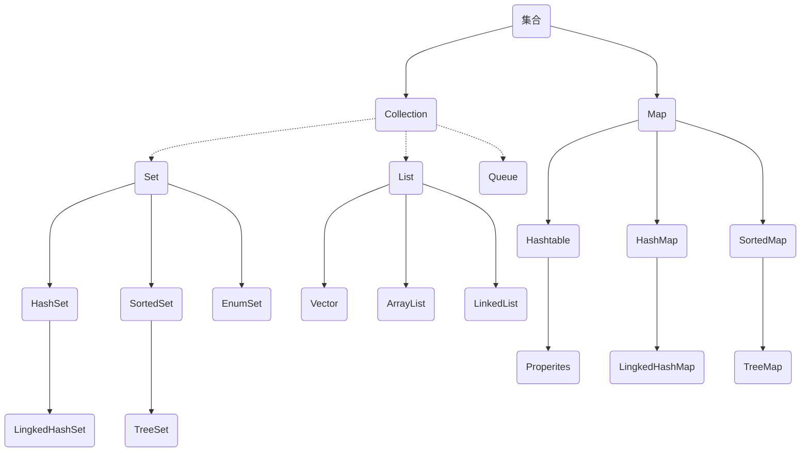

# Java基础知识

## 面向对象的基本原则

单一职责原则（**SRP**）

开放封闭原则（**OCP**） 

里氏替换原则（**LSP**） 

依赖倒置原则（**DIP**） 

接口隔离原则（**ISP**）

## 算法

算法包括0个或多个**输入**，1个或多个**输出**，中间有穷个**处理**过程。
存储结构不属于算法结构

## 编译与运行

java编译成的是class字节码文件，与系统无关。再被各系统的jvm翻译成系统可以识别的机器码，这就是java一次编程多平台应用的跨平台性。

字节码和机器码不是一回事，java程序在运行时字节码才会被jvm翻译成机器码，所以说java是解释性语言。

**native关键字**表名修饰的方法是由其它非Java语言编写的

能够出现在import语句前的有**注释语句**、用来声明包的**package语句**

## 标识符命名规则

由26个英文字母大小写，数字：0-9 符号：_ $ 组成

标识符应以字母、_ 、$开头

标识符不能是关键字

严格区分大小写

## Java关键字

Java中的关键字都是小写，null、false、true是常量，不是关键字。

| 访问控制         | private  | protected  | public   |           |              |           |        |
| ---------------- | -------- | ---------- | -------- | --------- | ------------ | --------- | ------ |
| 类方法变量修饰符 | abstract | class      | extends  | final     | implements   | interface | native |
|                  | new      | static     | strictfp | transient | synchronized | volatile  |        |
| 程序控制         | break    | continue   | return   | do        | while        | if        | else   |
|                  | for      | instanceof | switch   | case      | default      |           |        |
| 错误处理         | try      | catch      | throw    | throws    |              |           |        |
| 包相关           | import   | package    |          |           |              |           |        |
| 基本类型         | boolean  | byte       | char     | double    | float        | int       | long   |
|                  | short    |            |          |           |              |           |        |
| 变量引用         | super    | this       | void     |           |              |           |        |
| 保留字           | goto     | const      |          |           |              |           |        |
|                  | enum     | assert     |          |           |              |           |        |

## AOP 和 OOP的区别：

1. 面向方面编程 **AOP** 偏重业务处理过程的某个步骤或阶段，强调降低模块之间的耦合度，使代码拥有更好的移植性。
2. 面向对象编程 **OOP** 则是对业务分析中抽取的实体进行方法和属性的封装。
也可以说 AOP 是面向业务中的动词领域， OOP 面向名词领域。

# 基本语法

## 与或非

```java
b = i < 10 |  methodB(4); //中间为与计算符，两边都执行，执行完methodB(4)后，j = 4
b = i < 10 || methodB(8); //中间为或计算符，因为i < 10 已成立，不需要后续计算
```

## try/catch/finally

在try语句块或catch语句块中执行到System.exit(0)直接退出程序

不管catch是否捕获异常，finally语句块都是要被执行的

finally块中的return语句会覆盖try块中的return返回

finally 语句块在 catch语句块中的return语句执行完成之前，return表达式的结果会暂时保存起来

```java
int i = 0;
try {
    System.out.println("try" + i);
    throw new Exception("123");
} catch (Exception e) {
    return i++;
} finally {
    System.out.println("finally" + i);
}

//结果：
//try0
//finally1
```


# 数据类型

## 不同基本数值类型的自动转换

Java计算表达式转型规则由低到高转换：（待看视频）

1、所有的byte,short,char型的值将被提升为int型；

2、如果有一个操作数是long型，计算结果是long型；

3、如果有一个操作数是float型，计算结果是float型；

4、如果有一个操作数是double型，计算结果是double型；

5、被fianl修饰的变量不会自动改变类型，当2个final修饰相操作时，结果会根据左边变量的类型而转化。

## 基本数据类型包装类型

Byte是byte的包装类型，初始化为null而不是0

## 值范围

Byte类型值大小为-128~127之间，a=127,++a会越界，a的值变为-128;

## 自动装包/自动拆包

```java
public void add(Byte b){ 
    b=b++; 
} 
```

这里涉及java的自动装包/自动拆包(AutoBoxing/UnBoxing) Byte的首字母为大写，是类，看似是引用传递，但是在add函数内实现++操作，会自动拆包成byte值传递类型，方法调用处传入变量的值不会改变。

## String

java中将ISO8859-1字符串转成GB2312编码：

```java
new String("这是要转换的字符串".getBytes("ISO8859-1"),"GB2312")
    //1
    String.getBytes(String charsetName);//得到的是以charsetName编码得到的byte数组 byte[]  
	"这是要转换的字符串".getBytes("ISO8859-1");
	//2 String的构造函数 
    String (byte[] bytes,String charsetName);//符数组按照GB2312编码成新的字符串

dst=new String(src，"GBK").getBytes("UTF-8");
```

string和char数组都是引用类型，引用类型是传地址的，会影响原变量的值，但是string是特殊引用类型，作为参数传入后，方法只改变形参，原变量不变，类似基本数据类型

String是不可修改的，且java运行环境中对string对象有一个对象池保存

### replaceAll方法

**"com.jd.". replaceAll(".", "/")，**replaceAll方法的第一个参数是一个正则表达式

**"."**在正则表达式中表示任何字符，把前面字符串的所有字符都替换成"/"

如果想替换的只是**"."**，那么久要写成**\ \ .**

## 数组

在java 中，声明一个数组时，不能直接限定数组长度，只有在创建实例化对象时，才能对给定数组长度。

String a[]=new String[50];

String b[];

char c[];

## 字符、字节

Java采用unicode来表示字符，java中的一个char是2个字节（byte)，一个中文或英文字符的unicode编码都占2个字节。

在 GB 2312 编码或 GBK 编码中，一个英文字母字符存储需要1个字节，一个汉子字符存储需要2个字节。

在UTF-8编码中，一个英文字母字符存储需要1个字节，一个汉字字符储存需要3到4个字节。

在UTF-16编码中，一个英文字母字符存储需要2个字节，一个汉字字符储存需要3到4个字节（Unicode扩展区的一些汉字存储需要4个字节）。

在UTF-32编码中，世界上任何字符的存储都需要4个字节。

# 集合

**Collection**接口：单列数据，定义了存取一组对象的方法的集合

​	**List**：元素有序、可重复的集合

​			Vetor:

​			ArrayList:

​			LinkedList:

​	**Set**：元素无序、不可重复的集合

​			HashSet:

​				LingkedHashSet:

​			SortedSet:

​				TreeSet:

​	**Queue**:

**Map**接口：双列数据，保存具有映射关系“key-value对”的集合

​		Hashtable:

​			Properties:

​		HashMap:

​			LinkedHashMap:

​		SortedMap:

​			TreeMap:

## Hash冲突

**threadlocalmap**使用开放定址法解决hash冲突

**hashmap**使用链地址法解决hash冲突

## 线程安全

简单记忆线程安全的集合类： 

喂！SHE！  

喂 **vector**

S **stack** 

H **hashtable**，不能存储 null 值（hashmap可以）

E **Eenumeration**




# IO流

可以理解为字符流=字节流+编码集

字符流和字节流每次读入的字节数是**不确定**的，可能相同也可能不相同；字符流和字节流都有缓冲流

| (抽象基类) | 字节流       | 字符流 |
| ---------- | ------------ | ------ |
| **输入流** | InputStream  | Reader |
| **输出流** | OutputStream | Writer |

| 分类           | 字节输入流              | 字节输出流               | 字符输入流            | 字符输出流             |
| -------------- | ----------------------- | ------------------------ | --------------------- | ---------------------- |
| **抽象基类**   | **InputStream**         | **OutputStream**         | **Reader**            | **Writer**             |
| **访问文件**   | **FileInputStream**     | **FileOutputStream**     | **FileReader**        | **FileWriter**         |
| **访问数组**   | ByteArrayInputStream    | ByteArrayOutputStream    | CharArrayReader       | CharArrayWriter        |
| **访问管道**   | PipedInputStream        | PipedOutputStream        | PipedReader           | PipedWriter            |
| **访问字符串** |                         |                          | StringReader          | StringReader           |
| **缓冲流**     | **BufferedInputStream** | **BufferedOutputStream** | **BufferedReader**    | **BufferedWriter**     |
| **转换流**     |                         |                          | **InputStreamReader** | **OutputStreamWriter** |
| **对象流**     | **ObjectInputStream**   | **ObjectOutputStream**   |                       |                        |
|                | FilterInputStream       | FilterOutputStream       | FilterReader          | FilterWriter           |
| **打印流**     |                         | PrintOutputStream        |                       | PrintWriter            |
| **推回输入流** | PushbackInputStream     |                          | PushbackReader        |                        |
| **特殊流**     | DataInputStream         | DataOutputStream         |                       |                        |

> 字符流
> Reader 
> |-- InputStreamReader (byte->char 桥梁） 
> |-- BufferedReader (常用） 
> Writer 
> |-- OutputStreamWriter (char->byte 桥梁） 
> |-- BufferedWriter 
> |-- PrintWriter （常用）

按流的角色的不同分为：

节点流：可以从或向一个特定的地方（节点）读写数据。如FileReader.

处理流：是对一个已存在的流的连接和封装，通过所封装的流的功能调用实现数据读写。如BufferedReader.处理流的构造方法总是要带一个其他的流对象做参数。一个流对象经过其他流的多次包装，称为流的链接。

链接：https://www.nowcoder.com/questionTerminal/89307747e8904102b26505712a5191d4
来源：牛客网

## JAVA常用的节点流

文 件 FileInputStream FileOutputStrean FileReader FileWriter 文件进行处理的节点流。
字符串 StringReader StringWriter 对字符串进行处理的节点流。
数 组 ByteArrayInputStream ByteArrayOutputStreamCharArrayReader CharArrayWriter 对数组进行处理的节点流（对应的不再是文件，而是内存中的一个数组）。
管 道 PipedInputStream PipedOutputStream PipedReaderPipedWriter对管道进行处理的节点流。

## 常用处理流

（关闭处理流使用关闭里面的节点流）

缓冲流：BufferedInputStrean BufferedOutputStream BufferedReader BufferedWriter  增加缓冲功能，避免频繁读写硬盘。
转换流：InputStreamReader OutputStreamReader 实现字节流和字符流之间的转换。
数据流 DataInputStream DataOutputStream  等-提供将基础数据类型写入到文件中，或者读取出来.

## 流的关闭顺序

一般情况下是：先打开的后关闭，后打开的先关闭
另一种情况：看依赖关系，如果流a依赖流b，应该先关闭流a，再关闭流b。例如，处理流a依赖节点流b，应该先关闭处理流a，再关闭节点流b
可以只关闭处理流，不用关闭节点流。处理流关闭的时候，会调用其处理的节点流的关闭方法。


# 多线程

**CountDownLatch**：一个或者多个线程，等待其他多个线程完成某件事情之后才能执行； 

**CyclicBarrier**：多个线程互相等待，直到到达同一个同步点，再继续一起执行。

对于CountDownLatch来说，重点是“一个线程（多个线程）等待”，而其他的N个线程在完成“某件事情”之后，可以终止，也可以等待。 

而对于CyclicBarrier，重点是多个线程，在任意一个线程没有完成，所有的线程都必须互相等待，然后继续一起执行。 CountDownLatch是计数器，线程完成一个记录一个，只不过计数不是递增而是递减，而CyclicBarrier更像是一个阀门，需要所有线程都到达，阀门才能打开，然后继续执行。 按照这个题目的描述等所有线程都到达了这一个阀门处，再一起执行

## 线程安全

**synchrozied**关键字称作同步，主要用来给方法、代码块加锁，被加锁的代码段，同一时间内多线程同时访问同一对象的加锁方法/代码块时，只能有一个线程执行能执行方法/代码块中的代码，其余线程必须等待当前线程执行完以后才执行该方法/代码块。
**volatile**关键字1.保证了不同线程对该变量操作的内存可见性.(当一个线程修改了变量,其他使用次变量的线程可以立即知道这一修改)。2.禁止了指令重排序.
**Lock**接口提供了与synchronized关键字类似的同步功能，但需要在使用时手动获取锁和释放锁。
**transient**关键字  简单地说，就是让某些被修饰的成员属性变量不被序列化。

# 类相关

## 四种访问权限修饰符

**public > protected > (缺省)  > private**

|  修饰符   | 类内部 | 同一个包 | 不同包的子类 | 同一个工程 |
| :-------: | :----: | :------: | :----------: | :--------: |
|  private  |   √    |          |              |            |
| （缺省）  |   √    |    √     |              |            |
| protected |   √    |    √     |      √       |            |
|  public   |   √    |    √     |      √       |     √      |

对于class的权限修饰只可以用public和default(缺省)。
public类可以在任意地方被访问。
default类只可以被同一个包内部的类访问。

### 构造方法

构造方法可以用private，protected，default，private

在创建派生类对象，构造函数的执行顺序：

基类构造函数，派生类对象成员构造函数（成员构造函数是指，静态或非静态变量可能是其他类的实例，加载这个实例的时候就必须调用它自身的构造函数），派生类本身的构造函数


### 接口

接口方法的修饰符可以是：public，abstract，缺省，static（后两者需要有{}）

子类重写父类方法时，方法的访问权限不能小于原访问权限，在接口中，方法的默认权限就是public，所以子类重写后只能是public

## 内部类

内部类：

​	成员内部类：4种访问权限：private、protected、public以及默认的访问权限

​	局部内部类：方法中、代码块中。局部内部类和局部变量地位类似，不能使用public,protected,缺省,private；不能使用static修饰，因此也不能包含静态成员

```java
class 外部类{
    //方法
	Method(){
		class 局部内部类{
		}
	}
    //代码块
	{
		class 局部内部类{
		}
	}
}
```
# 声明关键字的使用

## final类与abstract类

**final**:修饰的类为终态类，不能被继承

**abstract**:修饰的类为抽象类，必须被继承才有意义

**abstract**类定义中可以没有abstract方法

**final**是不能用来修饰abstract抽象类，矛盾。

**abstract**类只能用来派生子类，不能用来创建abstract类的对象。

**final**类不能用来派生子类，因为用final修饰的类不能被继承；

**final**修饰的方法为终态方法，不能被重写。

**abstract**抽象方法不允许有方法体，同时不能有大括号，应直接以分号结束。

final是不能用来修饰abstract抽象方法，矛盾。

```java
public abstract class Test {
	abstract void method();//抽象方法
}
```

# JDBC

**ResultSet**跟普通的数组不同，索引从1开始而不是从0开始

# JVM

## JVM内存五大区域


**jvm堆**分为：

​	**新生代**（一般是一个Eden区，两个Survivor区），

​	**老年代**（old区）。

常量池属于 PermGen（方法区）

**jvm的垃圾回收方式**

新生代基本采用复制算法，老年代采用标记整理算法。cms采用标记清理。

## Java内存区域介绍

A.**程序计数器**是一块较小的内存空间，它的作用可以看做是当前线程所执行的字节码的信号指示器（偏移地址），Java编译过程中产生的字节码有点类似编译原理的指令，程序计数器的内存空间存储的是当前执行的字节码的偏移地址，每一个线程都有一个独立的程序计数器（程序计数器的内存空间是线程私有的），因为当执行语句时，改变的是程序计数器的内存空间，因此它不会发生内存溢出 ，并且程序计数器是jvm虚拟机规范中唯一一个没有规定 OutOfMemoryError 异常 的区域；

B.**java虚拟机栈**：线程私有，生命周期和线程一致。描述的是 Java 方法执行的内存模型：每个方法在执行时都会床创建一个栈帧(Stack Frame)用于存储局部变量表、操作数栈、动态链接、方法出口等信息。每一个方法从调用直至执行结束，就对应着一个栈帧从虚拟机栈中入栈到出栈的过程。  没有类信息，类信息是在方法区中

C.**java堆**：对于绝大多数应用来说，这块区域是 JVM 所管理的内存中最大的一块。线程共享，主要是存放对象实例和数组

D.**方法区**：属于共享内存区域，存储已被虚拟机加载的类信息、常量、静态变量、即时编译器编译后的代码等数据。

# jsp

JSP分页代码中，先取总记录数，得到总页数，最后显示本页的数据。

# 正则表达式

**^**匹配输入的开始

**$**匹配输入的结束

**?**匹配某元素0次或1次

**[]**表示字符集合，它用在正则表达式中表示匹配集合中的任一字符，[a-zA-Z\d] 表示匹配一个小写字母 或者 大写字母 或者 数字

**\w** 表示匹配字母数字或下划线

**+**表示匹配某元素1次或多次

*****表示匹配某元素0次或多次

**.**可以匹配除了换行符\n \r外的任何字符

**\D** 表示匹配一个非数字字符而非数字字符

**\d**匹配数字

**{m,n}**表示最少匹配m次，最多匹配n次

**\/?**能匹配末尾的0个或1个/字符

# servlet

Servlet生命周期分成3个阶段：

1）初始化阶段： init()  --> 初始化。

仅执行一次，负责在装载Servlet时初始化Servlet对象

​	初始化阶段：Servlet启动，会读取配置文件中的信息，

​	构造指定的Servlet对象，

​	创建ServletConfig对象，

​	将ServletConfig作为参数来调用init()方法。

2）响应客户请求：service()  -->  处理请求。

核心方法，一般HttpServlet中会有get,post两种处理方式。在调用doGet和doPost方法时会构造 **servletRequest **和 **servletResponse** 请求和响应对象作为参数。

3）终止： destory () --> 销毁（停止）

在停止并且卸载Servlet时执行，负责释放资源


Servlet过滤器的配置包括两部分：
第一部分是过滤器在Web应用中的定义，由**< filter>元素**表示，包括< filter-name>和< filter-class>两个必需的子元素
第二部分是过滤器映射的定义，由**< filter-mapping>元素**表示,可以将一个过滤器映射到一个或者多个Servlet或JSP文件，也可以采用url-pattern将过滤器映射到任意特征的URL。

# Web

## 会话跟踪

隐藏域

地址重写

Cookie

session